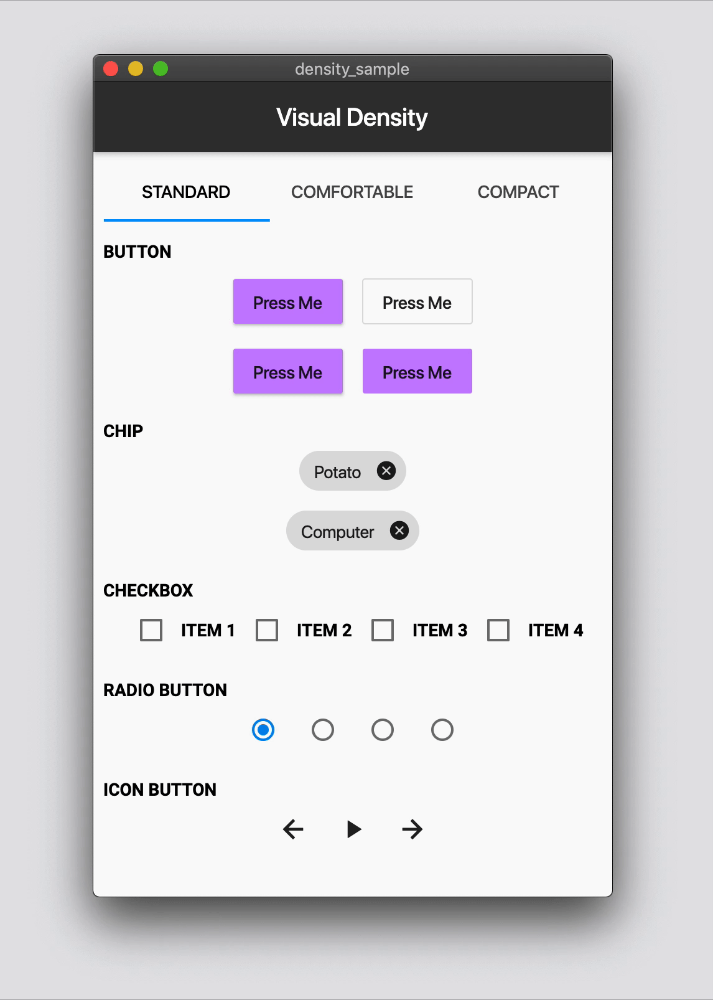

# density_sample

A sample of using the new [Material density](https://material.io/design/layout/applying-density.html) support in Flutter. 

## Usage

$ flutter packages get
$ flutter run

## Sample Code
Flutter v1.13 added support for a visualDensity property of the Theme, which allows you to set the density of widgets that choose to support it (checkbox, radio, chip and button as of this writing). You can change the density by setting the theme's visualDensity to an instance of type VisualDensity, e.g.

```dart
...
List<VisualDensity> densitySelected = <VisualDensity>[
  VisualDensity.standard,
  const VisualDensity(horizontal: -1.5, vertical: -1.5),
  const VisualDensity(horizontal: -3.0, vertical: -3.0),
];
...
AnimatedTheme(data: Theme.of(context).copyWith(visualDensity: densitySelected[i]),
...
```

You can see the details in [main.dart](lib/main.dart).

## Screen Shot



